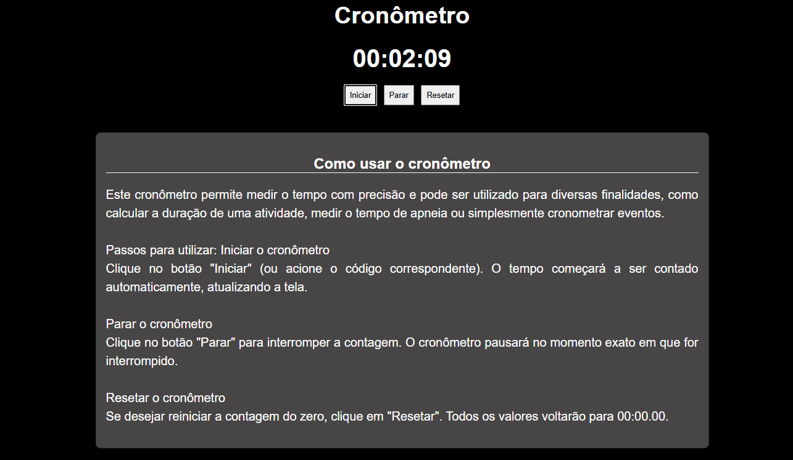

# Cronômetro Personalizado

Este repositório contém um cronômetro interativo desenvolvido com **JavaScript, HTML e CSS**. Ele é ideal para medir o tempo de forma precisa, incluindo segundos e milissegundos, e pode ser utilizado em diferentes aplicações, como esportes, desafios e medições de tempo personalizadas.

## 🛠 Funcionalidades
- **Iniciar** ⏳ – Dá início à contagem do tempo.
- **Parar** ⏹ – Pausa o cronômetro sem perder o tempo atual.
- **Resetar** 🔄 – Retorna o cronômetro ao tempo `00:00.00`.

## 🚀 Tecnologias Utilizadas
- **JavaScript** 🖥 – Manipulação do tempo e atualização dinâmica dos valores.
- **CSS** 🎨 – Estilização da interface e personalização visual.
- **HTML** 📜 – Estruturação dos elementos que compõem o cronômetro.

## 🖍 imagems do projeto




## 📌 Como Usar
1. Clone o repositório com o comando:
   ```bash
   git clone <URL_DO_REPOSITORIO>

   
